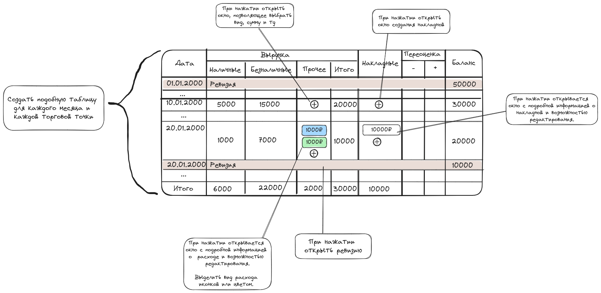

# Техническое задание по учебной практике

Требуется разработать программу по внутреннему учёту баланса торговой точки.

Требования к программе:

1. Общие требования
   - Программа должна быть выполнена в виде приложения для операционной среды Windows;
   - Программа должна работать без доступа к интернету;
   - Программа состоит из трёх модулей: учёт, ревизия, накладная;
   - Должна быть предусмотрена возможность расширения функционала программы путём разработки дополнительных модулей.
1. Учёт
   1. Предварительный вид модуля: 
   1. Модуль учёта подсчитывает текущий товарный баланс торговой точки;
   1. Модуль разделён по месяцам и торговым точкам;
   1. Выручка уменьшает товарный баланс
      1. Наличная и безналичная выручка указываются вручную через изменение таблицы;
      1. "Прочие расходы" представляют собой редактируемый список;
         1. При внесении или изменения прочего расхода можно указать:
            1. Вид
            1. Сумму
            1. Прочие поля, зависящие от вида
         1. Виды расходов и дополнительные поля:
            1. Аванс (продавец, взявший аванс)
            1. Оплата поставки (поставщик)
            1. Прочее (причина)
   1. Накладные увеличивают товарный баланс
      1. Накладные указываются в таблице в виде списка с возможностью изменения и добавления новых;
      1. Редактирование и добавление накладных производится через модуль "накладные".
   1. "Переоценка" напрямую увеличивает или уменьшает торговый баланс
   1. Проведённые ревизии показываются после строки того же дня;
      1. Дни после ревизии продолжают отсчёт с отстатком, установленном в результате ревизии;
      1. Визуально выделять строку ревизии (например, чёрным цветом)
1. Ревизия
   - При создании ревизии указывается дата, торговая точка и остаток денег в кассе;
   - При заполнение ревизии указывается только вес/количество и цена товара, стоимость товара считается автоматически;
   - Автоматически подсчитывается сумма стоимостей всех товаров и добавляется остаток денег в кассе, получившаяся сумма устанавливается в качестве начального баланса на следующий день;
   - Имеется возможность просмотра и изменения после заполнения.
1. Накладная
   - При создании накладной указывается дата, торговая точка и поставщик;
   - При заполнение накладной указывается только вес/количество и продажная цена товара, стоимость товара считается автоматически;
   - Автоматически подсчитывается сумма стоимостей всех товаров, получившаяся сумма прибавляется к товарному балансу точки;
   - Имеется возможность просмотра и изменения после заполнения.
